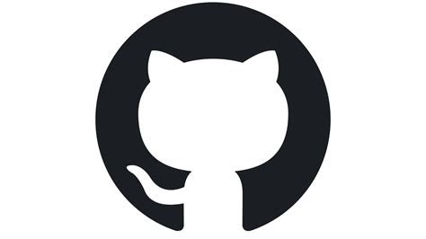

### <h1 align = "center">👋 Hi! I'm kylian</h1>

 ## What am I currently doing? 🧐

- developing a 2D RPG named Soulline - [itch.io - Soulline](https://soulworks.itch.io) 🎮 🌐
- learning Competitive-Programming using c++

 ## Languages and Tools I use: 

